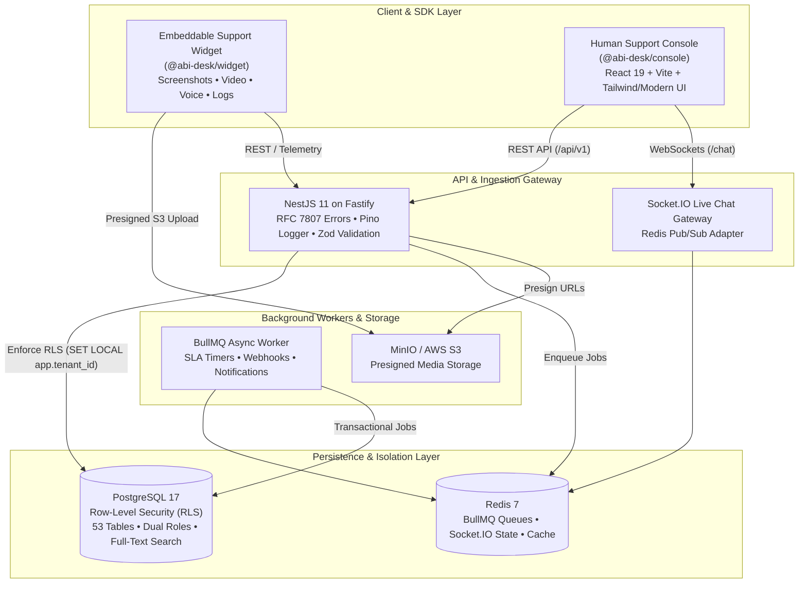
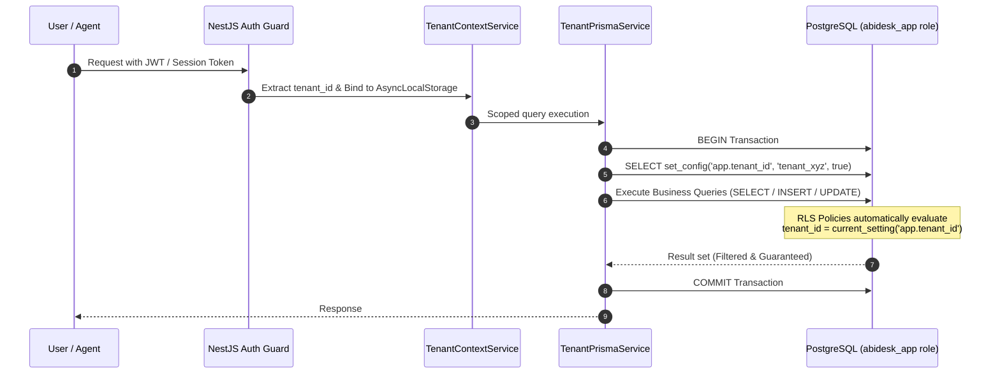

# ABI Desk — Enterprise Multi-Tenant Ticketing & Diagnostic Platform

<div align="center">

[](https://github.com/rajeshc-git/abi-desk/actions/workflows/ci.yml)
[](https://nodejs.org)
[](https://pnpm.io)
[](https://www.typescriptlang.org)
[](https://nestjs.com)
[](https://react.dev)
[](https://www.postgresql.org)
[](https://www.prisma.io)
[](https://redis.io)
[](https://turbo.build)

<br/>

**An enterprise-grade SaaS helpdesk and customer support platform built for high-throughput isolation, featuring zero-leak PostgreSQL Row-Level Security, multi-tier escalation workflows, real-time live chat desk, SLA calculation engines, and an embeddable customer diagnostics widget that captures annotated screenshots, screen recordings, voice notes, and runtime telemetry directly into tickets.**

[Quick Start](#-quick-start) • [Architecture](#-architecture--technology-stack) • [Tenant Security (RLS)](#-tenant-isolation--database-security) • [RBAC Matrix](#-role-based-access-control-rbac) • [Embeddable Widget](#-embeddable-diagnostics-widget-sdk) • [API Reference](#-api-endpoints--swagger-documentation) • [Testing](#-verification--testing)

</div>

---

## 🌟 Key Capabilities

- 🛡️ **Zero-Leak Row Level Security (RLS)**: Enforced directly at the PostgreSQL layer across all 50 tenant-scoped tables using dual database roles (`abidesk_owner` for DDL, `abidesk_app` for runtime queries) and transactional session context.
- 🎯 **Fine-Grained RBAC Matrix**: 8 distinct roles (Guest, L1, L2, L3, Dev, QA, Tenant Admin, Platform Admin), 63 granular permissions, and 284 role grants verified with 100% test coverage.
- 🎥 **Rich Ingestion Widget SDK**: Embeddable customer widget capturing canvas-annotated screenshots, WebM video screen recordings, voice memos, browser console traces, network waterfalls, and uncaught JS exceptions uploaded directly to S3/MinIO via presigned URLs.
- ⏱️ **Real-Time SLA & Automation Engine**: Luxon-powered business hours calculators with holiday calendars, pause/resume lifecycles, and recursive condition evaluators with loop prevention.
- 💬 **Live Chat & Omnichannel Desk**: Real-time Socket.IO WebSocket gateway with Redis pub/sub adapter, typing presence, agent assignment, and one-click chat-to-ticket promotion.
- 🔐 **Zero-Trust Enterprise Auth & SSO**: Argon2id password hashing, rotating refresh tokens, magic link invitations, OIDC (PKCE discovery), and SAML 2.0 federation.
- 📜 **Full Auditability & Compliance**: Append-only PostgreSQL trigger-enforced audit trails, GDPR / DPDPA Data Subject Rights (DSR) export and in-place erasure, and configurable retention purges.
- ⚡ **Turborepo Monorepo Architecture**: High-speed builds and shared contracts (`@abi-desk/rbac`, `@abi-desk/db`, `@abi-desk/config`, `@abi-desk/widget`) consumed seamlessly across backend and frontend.

---

## 🏗 Architecture & Technology Stack



### Technology Matrix

| Layer | Technology | Rationale |
| :--- | :--- | :--- |
| **API Framework** | [NestJS 11](https://nestjs.com) + [Fastify](https://fastify.dev) | High throughput HTTP layer with strong module/DI encapsulation and custom guard pipelines. |
| **Agent Console** | [React 19](https://react.dev) + [Vite](https://vite.dev) | Lightning-fast HMR, component-driven workspace for support agents, and responsive ticket triage. |
| **Database** | [PostgreSQL 17](https://www.postgresql.org) + [Prisma 6.19](https://www.prisma.io) | Native PostgreSQL Row Level Security (RLS), trigger-based audit logs, multi-file Prisma schema. |
| **Queue & Worker** | [BullMQ](https://bullmq.io) + [Redis 7](https://redis.io) | Distributed queue handling delayed SLA timer triggers, webhook deliveries, and retry backoffs. |
| **Object Storage** | [MinIO](https://min.io) (S3 Compatible) | Direct browser-to-S3 uploads via presigned URLs, offloading media transfers from the API process. |
| **Contract Validation** | [Zod](https://zod.dev) | Single source of truth for runtime validation, TypeScript typing, and OpenAPI generation. |
| **Monorepo Engine** | [pnpm](https://pnpm.io) + [Turborepo](https://turbo.build) | Strict workspace dependency management, cached builds, and shared zero-dependency packages. |

---

## 📁 Repository Structure

```
.
├── apps/
│   ├── api/                    # NestJS 11 API + Background Worker (PROCESS_ROLE=api|worker)
│   │   ├── src/common/         # RFC 7807 problem exceptions, Pino logging, Zod validation pipes
│   │   ├── src/config/         # Zod-validated environment contract schema
│   │   ├── src/infra/          # Prisma client, Redis connections, Tenant Context AsyncLocalStorage
│   │   └── src/modules/        # 16+ domain feature modules (Tickets, SLA, Workflow, Media, SSO, etc.)
│   └── console/                # React 19 + Vite Human Support Agent Console & Admin Web Portal
│       ├── src/pages/          # Inbox, Ticket Detail Workspace, Live Chat, Analytics, Admin Center
│       └── src/components/     # Timeline, SLA Timers, Diagnostics Terminal, Media Players
├── packages/
│   ├── widget/                 # Embeddable Diagnostics Widget SDK (@abi-desk/widget)
│   │   ├── src/media/          # Screenshot Annotator, Screen Video Recorder, Voice Notes
│   │   └── src/telemetry/      # Console logs, Network traces, Uncaught JS error capturers
│   ├── db/                     # Prisma multi-file schema (12 domains), migrations, RLS policies, seeds
│   ├── rbac/                   # 63 permissions, 8 roles, 284 grants (pure TypeScript, 0 runtime deps)
│   └── config/                 # Shared TypeScript & ESLint base configurations
├── docker/
│   ├── api/                    # Production & Development multi-stage Dockerfile
│   └── postgres/init/          # Database bootstrap, role initialization, and extension scripts
├── docker-compose.yml          # Complete orchestrator (PostgreSQL, Redis, MinIO, Mailpit, API, Worker)
├── run.sh / run.bat            # Automated one-click local launcher (Hybrid Mode)
├── stop.sh / stop.bat          # Graceful teardown scripts
└── widget_demo.html            # Standalone browser test page demonstrating widget integration
```

---

## 🚀 Quick Start

### ⚡ 1-Minute Fresh Clone Setup (Zero Manual Configuration)

For a fresh clone on any machine, you only need **Docker Desktop**, **Node.js 22+**, and **pnpm 9+**.

```bash
# 1. Clone the repository
git clone https://github.com/rajeshc-git/abi-desk.git
cd abi-desk
```

```bash
# 2. Run the one-click automated launcher for your OS:
```

| Operating System | Command | Graceful Teardown |
| :--- | :--- | :--- |
| **🍎 macOS / Linux** | `chmod +x run.sh stop.sh && ./run.sh` | `./stop.sh` |
| **🪟 Windows** | `run.bat` *(or double-click `run.bat`)* | `stop.bat` |

> 💡 **What the one-click automated launcher does for you:**
> 1. ✅ **Auto-provisions `.env`**: Copies `.env.example` &rarr; `.env` if not present.
> 2. ✅ **Auto-installs packages**: Executes `pnpm install` across all monorepo apps and packages.
> 3. ✅ **Boots backend containers**: Starts PostgreSQL 17, Redis 7, MinIO, Mailpit, NestJS API & BullMQ Worker.
> 4. ✅ **Applies database migrations**: Automatically deploys 53 tables, dual security roles, and RLS policies.
> 5. ✅ **Launches live frontends**: Boots the React Agent Console ([`http://localhost:9999`](http://localhost:9999)) and Prisma Studio in the background with Vite Hot Module Replacement (HMR).

---

### Alternative Development Modes

#### Option A: Full Docker Mode
Run all services (including the API and Worker) inside Docker containers:

```bash
# 1. Configure environment variables
cp .env.example .env

# 2. Install workspace dependencies
pnpm install

# 3. Boot all containers in detached mode
docker compose up -d --build
```

---

### Option 3: Full Host Dev Mode (Backend & Frontend Local Reloading)

If you are modifying backend NestJS code and want native TypeScript reload without Docker rebuilds:

```bash
# 1. Start only backing infrastructure services
docker compose up -d postgres redis minio minio-init mailpit

# 2. Deploy database migrations and baseline
pnpm db:migrate

# 3. Run all development processes across the monorepo
pnpm dev
```

---

## 🌐 Service Ports & Access Points

| Service | Address / URL | Description |
| :--- | :--- | :--- |
| **Agent Support Console** | [`http://localhost:9999`](http://localhost:9999) | React 19 Frontend Web Portal |
| **Swagger API Docs** | [`http://localhost:4000/docs`](http://localhost:4000/docs) | Interactive OpenAPI 3.0 Documentation |
| **API Server Base** | [`http://localhost:4000/api/v1`](http://localhost:4000/api/v1) | Fastify REST API Gateway |
| **Health Liveness Probe** | [`http://localhost:4000/healthz`](http://localhost:4000/healthz) | Process liveness probe |
| **Health Readiness Probe** | [`http://localhost:4000/readyz`](http://localhost:4000/readyz) | Deep dependency latency check (DB, Redis) |
| **Mailpit Inbox** | [`http://localhost:8025`](http://localhost:8025) | Local SMTP test server & web inbox |
| **MinIO Console** | [`http://localhost:9001`](http://localhost:9001) | S3 Object Storage Browser UI |
| **PostgreSQL Database** | `localhost:5432` | PostgreSQL 17 server (`abidesk` DB) |
| **Widget Demo Page** | Open `widget_demo.html` in browser | Interactive live SDK testing sandbox |

---

## 🔒 Tenant Isolation & Database Security

Multi-tenant security in ABI Desk does not rely on application developers remembering `WHERE tenant_id = ?`. Tenant isolation is enforced as an unbypassable guarantee by the database engine.



### PostgreSQL Roles Architecture
Created by [`docker/postgres/init/01-init-roles.sh`](./docker/postgres/init/01-init-roles.sh):

1. **`postgres`** *(Superuser)*: Used strictly for container bootstrap and extension initialization.
2. **`abidesk_owner`** *(DDL Owner)*: Schema owner used exclusively by Prisma Migrate during deployments. Bypasses RLS to execute structural DDL migrations.
3. **`abidesk_app`** *(Runtime Access)*: Runtime role used by API and BullMQ worker. Owns no tables, meaning **Row Level Security is strictly and unconditionally enforced**.

### Verifying RLS Enforcement

Run the automated PostgreSQL RLS smoke tests:

```bash
pnpm db:check
```

Expected output:
```
PASS  no tenant context -> 0 rows visible (Fails closed)
PASS  tenant context acme -> only acme visible
PASS  explicit cross-tenant id -> 0 rows
PASS  cross-tenant INSERT rejected by RLS WITH CHECK
PASS  tenant context does not outlive its transaction
PASS  audit_log UPDATE rejected (Immutable)
PASS  audit_log DELETE rejected without retention flag
PASS  retention purge flag permits DELETE
PASS  explicit bypass sees all tenants
PASS  runtime role cannot create objects
```

---

## 👥 Role-Based Access Control (RBAC)

The system incorporates an exhaustive authorization matrix codified in [`@abi-desk/rbac`](./packages/rbac/src/roles.ts) with **63 permissions**, **8 roles**, and **284 grants**:

| Role | Domain / Purpose | Key Responsibilities |
| :--- | :--- | :--- |
| **GUEST** | Customer / Ticket Creator | Submit tickets, attach diagnostic bundles, confirm resolution, view own tickets. |
| **L1** | Frontline Support Specialist | Triage tickets, respond to customers, execute initial troubleshooting, basic reassignments. |
| **L2** | Technical Support Engineer | Advanced diagnosis, SLA escalations, cross-queue routing, diagnostic bundle inspection. |
| **L3** | Product & Escalation Lead | Senior escalation point, emergency transitions, SLA policy reviews, approvals. |
| **DEV** | Engineering & Development | Internal issue investigation, reproduction reviews, error log inspections, bug resolution notes. |
| **QA_TEAM** | Quality Assurance | Verification of bugfixes, resolution validation, test confirmations. |
| **TENANT_ADMIN** | Organization Administrator | Team/Queue configuration, staff user management, brand styling, widget customization, SLA targets. |
| **PLATFORM_ADMIN** | Multi-Tenant Platform Operator | Cross-tenant administration, system monitoring, tenant provisioning. |

Run RBAC Matrix tests:
```bash
pnpm --filter @abi-desk/rbac test
```

---

## 📦 Embeddable Diagnostics Widget SDK

The SDK package `@abi-desk/widget` attaches directly to client web applications to ingest enriched bug reports.

```html
<!-- Include Widget in any HTML page -->
<script type="module">
  import { initWidget } from './packages/widget/dist/index.js';

  initWidget({
    endpoint: 'http://localhost:4000/api/v1',
    brandId: 'brand_default_001',
    accentColor: '#3B82F6',
    title: 'Need Help?',
    enableScreenshots: true,
    enableVideoRecording: true,
    enableVoiceNotes: true,
    captureTelemetry: true
  });
</script>
```

### Telemetry & Media Capabilities
- 📸 **Screen Capture & Canvas Annotator**: Allows users to draw rectangles, arrows, text callouts, and blackout redaction boxes over screenshots.
- 🎥 **WebM Video Screen Recorder**: Native `MediaRecorder` screen stream capture with audio.
- 🎙️ **Voice Note Memo**: Real-time microphone audio recording with visual waveform feedback.
- 🪵 **Browser Console Capture**: Wraps `console.log`, `warn`, `error` with timestamps and JSON serialization.
- 🌐 **Network Request Trace**: Intercepts `fetch` and `XMLHttpRequest` for latency and status tracing (with authorization token scrubbing).
- 💥 **Runtime Error Tracker**: Automatically hooks `window.onerror` and `window.onunhandledrejection`.

---

## 📡 API Endpoints & Swagger Documentation

Interactive OpenAPI documentation is live at `http://localhost:4000/docs`.

| Domain | Method & Route | Description |
| :--- | :--- | :--- |
| **Auth** | `POST /api/v1/auth/register` | Self-service organization & admin registration |
| **Auth** | `POST /api/v1/auth/login` | Login with Argon2id credentials & issue tokens |
| **Tickets** | `GET /api/v1/tickets` | Multi-criteria ticket query with search, sort, filter |
| **Tickets** | `POST /api/v1/tickets` | Create a new ticket with initial diagnostics |
| **Workflow** | `POST /api/v1/workflow/transition` | Execute state machine transition with validation |
| **Workflow** | `POST /api/v1/tickets/bulk` | Bulk reassignment, status changes, and priority updates |
| **Approvals** | `POST /api/v1/approvals/:id/decision` | Approve or reject pending workflow gate |
| **Media** | `POST /api/v1/media/presign-upload` | Issue S3 presigned upload URL for direct client PUT |
| **Automation** | `GET /api/v1/automation-rules` | Query tenant automation triggers and actions |
| **SLA** | `GET /api/v1/sla/policies` | Retrieve active SLA policies and target configurations |
| **Live Chat** | `GET /api/v1/chat/conversations` | Retrieve active live chat rooms (WebSocket on `/chat`) |
| **Analytics** | `GET /api/v1/analytics/overview` | Ticket volume metrics, MTTR, SLA compliance, CSAT |
| **Admin** | `GET /api/v1/admin/users` | Manage tenant user roster and team assignments |
| **Compliance** | `POST /api/v1/compliance/dsr` | Submit GDPR/DPDPA Data Subject Rights export/erasure |

---

## 🧪 Verification & Testing

Execute the test suites across the monorepo:

```bash
# 1. Typecheck the entire workspace
pnpm typecheck

# 2. Run all unit and matrix test suites
pnpm test

# 3. Run RBAC Matrix Conformance suite (84 tests)
pnpm --filter @abi-desk/rbac test

# 4. Run API Unit & Integration tests
pnpm --filter @abi-desk/api test

# 5. Run Database Drift & RLS Smoke Checks
pnpm --filter @abi-desk/db run check:rls

# 6. Run workspace build
pnpm build
```

---

## 👥 Contributors & License

- **Repository**: [rajeshc-git/abi-desk](https://github.com/rajeshc-git/abi-desk)
- **Maintainer**: Rajesh C
- **License**: Private & Proprietary Enterprise Software. All rights reserved.
